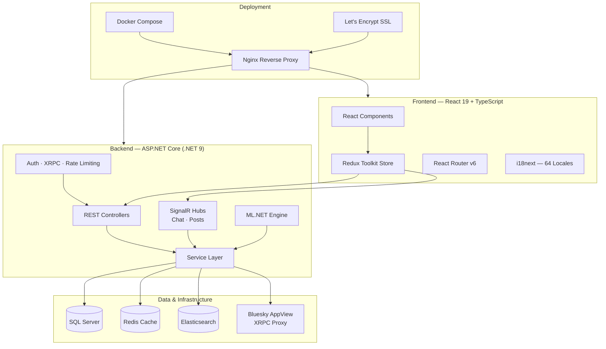

<p align="center">
  
</p>

<h1 align="center">BlueSky Clone</h1>

<p align="center">
  <strong>A full-featured, open-source social network inspired by Bluesky — built with .NET 9 &amp; React 19.</strong>
</p>

<p align="center">
  <a href="#"></a>
  <a href="#"></a>
  <a href="#">= 18" /></a>
  <a href="#"></a>
  <a href="#"></a>
  <a href="LICENSE"></a>
</p>

> **Disclaimer:** This project is an independent, open-source portfolio and educational project. It is **not affiliated with, endorsed by, or associated with Bluesky PBLLC**. For the official Bluesky client, visit [github.com/bluesky-social/social-app](https://github.com/bluesky-social/social-app).

---

<h3 align="center">✨ What's Inside</h3>

<table align="center">
  <tr>
    <td align="center" width="150">📝<br/><b>Posts & Threads</b><br/><sub>Rich text, images, video, link previews</sub></td>
    <td align="center" width="150">💬<br/><b>Real-Time Chat</b><br/><sub>1:1 & group DMs via SignalR</sub></td>
    <td align="center" width="150">🔔<br/><b>Notifications</b><br/><sub>Live push for likes, follows, replies</sub></td>
    <td align="center" width="150">🔍<br/><b>Search</b><br/><sub>Full-text via Elasticsearch</sub></td>
  </tr>
  <tr>
    <td align="center" width="150">📈<br/><b>Trending</b><br/><sub>Hashtags & popular posts</sub></td>
    <td align="center" width="150">🧠<br/><b>Smart Feeds</b><br/><sub>ML-powered recommendations</sub></td>
    <td align="center" width="150">🌍<br/><b>64 Languages</b><br/><sub>i18next localization</sub></td>
    <td align="center" width="150">🌐<br/><b>AT Protocol</b><br/><sub>XRPC proxy & firehose</sub></td>
  </tr>
  <tr>
    <td align="center" width="150">👥<br/><b>Follow & Lists</b><br/><sub>Social graph & curated lists</sub></td>
    <td align="center" width="150">🛡️<br/><b>Moderation</b><br/><sub>Mutes, blocks, labels, reports</sub></td>
    <td align="center" width="150">🔐<br/><b>Secure Auth</b><br/><sub>JWT + HttpOnly cookies</sub></td>
    <td align="center" width="150">🐳<br/><b>Docker Ready</b><br/><sub>One-command deployment</sub></td>
  </tr>
</table>

---

## Table of Contents

- [Overview](#overview)
- [Architecture](#architecture)
- [Prerequisites](#prerequisites)
- [Getting Started](#getting-started)
  - [Clone the Repository](#clone-the-repository)
  - [Backend Setup](#backend-setup)
  - [Frontend Setup](#frontend-setup)
  - [Docker Setup](#docker-setup)
  - [Environment Variables](#environment-variables)
- [Project Structure](#project-structure)
- [API Reference](#api-reference)
- [Features](#features)
- [Internationalization](#internationalization)
- [Running Tests](#running-tests)
- [Deployment](#deployment)
- [Contributing](#contributing)
- [License](#license)

---

## Overview

**BlueSky Clone** is a full-stack social networking platform that replicates the core experience of [Bluesky](https://bsky.app) with a modern, extensible architecture. It provides a rich, real-time social experience with support for posts, threads, likes, reposts, follows, direct messaging, notifications, content moderation, custom feeds, and more.

### Key Highlights

- **AT Protocol Integration** — Bridges with the official Bluesky AppView via XRPC proxy for data federation
- **Real-Time Messaging** — Live chat powered by SignalR WebSocket hubs
- **Smart Feeds** — ML-powered content categorization and recommendation engine using ML.NET
- **Full-Text Search** — Elasticsearch-backed search for posts and users
- **Multi-Language Support** — Localized in 64 languages with i18next
- **Content Moderation** — Built-in labeling, muted words, blocked/muted accounts, and report system
- **Guest Browsing** — Public explore feed with auth-wall for interactive features

---

## Architecture



---

## Prerequisites

| Tool | Version | Purpose |
|------|---------|---------|
| [.NET SDK](https://dotnet.microsoft.com/download) | 9.0+ | Backend runtime & build |
| [Node.js](https://nodejs.org/) | 18+ | Frontend tooling |
| [npm](https://www.npmjs.com/) | 9+ | Package management |
| [SQL Server](https://www.microsoft.com/en-us/sql-server) | 2019+ | Primary database |
| [Docker](https://www.docker.com/) | 20+ | Containerized deployment (optional) |
| [Redis](https://redis.io/) | 7+ | Distributed caching (production) |
| [Elasticsearch](https://www.elastic.co/) | 8.12+ | Full-text search (optional) |

---

## Getting Started

### Clone the Repository

```bash
git clone https://github.com/Tsutsuji2002/BlueSkyClone.git
cd BlueSkyClone
```

### Backend Setup

1. **Navigate to the backend directory:**

   ```bash
   cd backend
   ```

2. **Configure the database connection** in `appsettings.Development.json`:

   ```json
   {
     "ConnectionStrings": {
       "DefaultConnection": "Server=localhost,1433;Database=BlueSkyClone;User Id=sa;Password=YOUR_PASSWORD;TrustServerCertificate=True;MultipleActiveResultSets=True;"
     },
     "Jwt": {
       "Key": "your-secret-key-at-least-32-characters-long",
       "Issuer": "BSkyCloneAPI",
       "Audience": "BSkyCloneWeb"
     }
   }
   ```

3. **Restore packages and apply migrations:**

   ```bash
   dotnet restore
   dotnet ef database update
   ```

4. **Run the backend:**

   ```bash
   dotnet run
   ```

   The API will be available at `https://localhost:5001` with Swagger UI at `/swagger`.

### Frontend Setup

1. **Navigate to the frontend directory:**

   ```bash
   cd frontend
   ```

2. **Create the `.env` file** from the example:

   ```bash
   cp .env.example .env
   ```

3. **Install dependencies and start the dev server:**

   ```bash
   npm install
   npm start
   ```

   The app will open at `http://localhost:3000`.

### Docker Setup

Spin up the full stack with a single command:

```bash
# Development
docker compose up --build

# Production (includes SQL Server, Certbot SSL, Nginx)
docker compose -f docker-compose.yml -f docker-compose.prod.yml up --build -d
```

| Service         | Port  | Description                  |
|-----------------|-------|------------------------------|
| Frontend        | 3000  | React dev server             |
| Backend API     | 5000  | ASP.NET Core API             |
| Redis           | 6379  | In-memory cache              |
| Elasticsearch   | 9200  | Full-text search engine      |
| Kibana          | 5601  | Elasticsearch dashboard      |
| SQL Server†     | 1433  | Database (production only)   |

> † In development, the app uses your local SQL Server instance. The containerized SQL Server is enabled only in `docker-compose.prod.yml`.

### Environment Variables

| Name | Description | Example |
|------|-------------|---------|
| `DATABASE_URL` | SQL Server connection string | `Server=localhost;Database=BlueSkyClone;...` |
| `JWT_SECRET` | Secret key for JWT token signing (min 32 chars) | `your-long-random-secret-key` |
| `REDIS_URL` | Redis connection string | `redis:6379` |
| `REACT_APP_API_URL` | Backend API base URL | `https://bskyclone.site/api` |
| `REACT_APP_HUB_URL` | SignalR hub URL for real-time chat | `https://bskyclone.site/hubs/chat` |
| `REACT_APP_GIPHY_API_KEY` | GIPHY API key for GIF support in chat | `your-giphy-api-key` |
| `DOMAIN_NAME` | Production domain for SSL certificates | `bskyclone.site` |
| `DB_PASSWORD` | SQL Server SA password (production) | `YourStrongPassword123!` |
| `ASPNETCORE_ENVIRONMENT` | Runtime environment | `Development` or `Production` |

---

## Project Structure

```
BlueSkyClone/
├── backend/                          # ASP.NET Core Web API
│   ├── Controllers/                  # API endpoint controllers
│   │   ├── AuthController.cs         #   Authentication & registration
│   │   ├── PostsController.cs        #   CRUD for posts & threads
│   │   ├── ProfileController.cs      #   User profiles & follows
│   │   ├── FeedsController.cs        #   Custom feed management
│   │   ├── ChatController.cs         #   Direct messaging
│   │   ├── NotificationsController.cs#   Push notifications
│   │   ├── SearchController.cs       #   Full-text search
│   │   ├── ListsController.cs        #   User-curated lists
│   │   ├── TrendingController.cs     #   Trending topics & hashtags
│   │   ├── AdminController.cs        #   Admin panel operations
│   │   ├── MediaController.cs        #   Image/video uploads
│   │   └── XrpcController.cs         #   AT Protocol XRPC proxy
│   ├── Models/                       # Entity Framework models
│   ├── DTOs/                         # Data transfer objects
│   ├── Services/                     # Business logic layer
│   │   ├── PostService.cs            #   Post operations & feed algorithms
│   │   ├── UserService.cs            #   User management & settings
│   │   ├── ChatService.cs            #   Chat & conversations
│   │   ├── FeedService.cs            #   Feed generation & curation
│   │   ├── AuthService.cs            #   JWT auth & token management
│   │   ├── ElasticSearchService.cs   #   Elasticsearch integration
│   │   ├── FirehoseService.cs        #   AT Protocol firehose consumer
│   │   ├── XrpcProxyService.cs       #   Bluesky AppView proxy
│   │   └── ML/                       #   ML.NET recommendation models
│   ├── Hubs/                         # SignalR real-time hubs
│   │   ├── ChatHub.cs                #   Live messaging
│   │   └── PostHub.cs                #   Live post updates
│   ├── Repositories/                 # Data access layer
│   ├── UnitOfWork/                   # Unit of Work pattern
│   ├── Middleware/                   # Custom middleware
│   ├── Migrations/                   # EF Core migrations
│   ├── Dockerfile                    # Backend container image
│   └── Program.cs                    # App bootstrap & DI config
│
├── frontend/                         # React 19 SPA
│   ├── src/
│   │   ├── components/               # Reusable UI components
│   │   │   ├── feed/                 #   Post cards, feeds, timelines
│   │   │   ├── profile/              #   Profile headers, stats
│   │   │   ├── messages/             #   Chat interface
│   │   │   ├── notifications/        #   Notification items
│   │   │   ├── explore/              #   Discover & trending
│   │   │   ├── lists/                #   List management
│   │   │   ├── auth/                 #   Login, signup, auth walls
│   │   │   ├── layout/               #   App shell, navigation
│   │   │   ├── sidebar/              #   Left & right sidebars
│   │   │   ├── admin/                #   Admin dashboard
│   │   │   ├── modals/               #   Dialogs & overlays
│   │   │   └── common/               #   Shared UI primitives
│   │   ├── pages/                    # Route-level page components
│   │   ├── redux/                    # Redux Toolkit slices & store
│   │   ├── services/                 # API client layer (Axios)
│   │   ├── hooks/                    # Custom React hooks
│   │   ├── modals/                   # Modal definitions
│   │   ├── routes/                   # Route configuration
│   │   ├── types/                    # TypeScript type definitions
│   │   ├── locales/                  # i18n translation files (64 langs)
│   │   ├── utils/                    # Utility functions
│   │   ├── constants/                # App-wide constants
│   │   └── App.tsx                   # Root application component
│   ├── public/                       # Static assets
│   ├── tailwind.config.js            # Tailwind CSS configuration
│   ├── Dockerfile                    # Frontend container image
│   └── package.json                  # Dependencies & scripts
│
├── docker-compose.yml                # Development stack
├── docker-compose.prod.yml           # Production stack (+ SQL, SSL)
├── docker-compose.override.yml       # Local overrides
├── deploy.sh                         # Production deployment script
├── certbot/                          # Let's Encrypt SSL certificates
└── .env.example                      # Environment variable template
```

---

## API Reference

### Authentication

| Method | Route | Auth | Description |
|--------|-------|:----:|-------------|
| `POST` | `/api/auth/register` | ✗ | Register a new user account |
| `POST` | `/api/auth/login` | ✗ | Authenticate and receive JWT (HttpOnly cookie) |
| `POST` | `/api/auth/logout` | ✓ | Invalidate the current session |
| `POST` | `/api/auth/refresh` | ✓ | Refresh the access token |

### Posts

| Method | Route | Auth | Description |
|--------|-------|:----:|-------------|
| `GET` | `/api/posts` | ✗ | Get paginated post feed |
| `GET` | `/api/posts/{id}` | ✗ | Get a single post with thread |
| `POST` | `/api/posts` | ✓ | Create a new post (text, images, video) |
| `DELETE` | `/api/posts/{id}` | ✓ | Delete own post |
| `POST` | `/api/posts/{id}/like` | ✓ | Like a post |
| `DELETE` | `/api/posts/{id}/like` | ✓ | Unlike a post |
| `POST` | `/api/posts/{id}/repost` | ✓ | Repost to own feed |
| `POST` | `/api/posts/{id}/reply` | ✓ | Reply to a post |
| `GET` | `/api/posts/{id}/liked-by` | ✗ | List users who liked the post |
| `GET` | `/api/posts/{id}/reposted-by` | ✗ | List users who reposted |
| `GET` | `/api/posts/{id}/quotes` | ✗ | List quote posts |

### Profiles & Social Graph

| Method | Route | Auth | Description |
|--------|-------|:----:|-------------|
| `GET` | `/api/profile/{handle}` | ✗ | Get user profile |
| `PUT` | `/api/profile` | ✓ | Update own profile |
| `POST` | `/api/profile/{id}/follow` | ✓ | Follow a user |
| `DELETE` | `/api/profile/{id}/follow` | ✓ | Unfollow a user |
| `GET` | `/api/profile/{id}/followers` | ✗ | List followers |
| `GET` | `/api/profile/{id}/following` | ✗ | List following |
| `POST` | `/api/profile/{id}/block` | ✓ | Block a user |
| `POST` | `/api/profile/{id}/mute` | ✓ | Mute a user |

### Feeds & Discovery

| Method | Route | Auth | Description |
|--------|-------|:----:|-------------|
| `GET` | `/api/feeds` | ✗ | List available custom feeds |
| `GET` | `/api/feeds/{id}` | ✗ | Get a specific feed's posts |
| `GET` | `/api/unifiedfeed/following` | ✓ | Chronological following feed |
| `GET` | `/api/trending/hashtags` | ✗ | Get trending hashtags |
| `GET` | `/api/trending/posts` | ✗ | Get trending posts |
| `GET` | `/api/search` | ✗ | Search posts and users |

### Chat & Messaging

| Method | Route | Auth | Description |
|--------|-------|:----:|-------------|
| `GET` | `/api/chat/conversations` | ✓ | List user conversations |
| `POST` | `/api/chat/conversations` | ✓ | Start a new conversation |
| `GET` | `/api/chat/conversations/{id}` | ✓ | Get messages in a conversation |
| `POST` | `/api/chat/conversations/{id}/messages` | ✓ | Send a message |

### Lists & Notifications

| Method | Route | Auth | Description |
|--------|-------|:----:|-------------|
| `GET` | `/api/lists` | ✓ | Get user's lists |
| `POST` | `/api/lists` | ✓ | Create a new list |
| `GET` | `/api/notifications` | ✓ | Get notifications feed |
| `PUT` | `/api/notifications/read` | ✓ | Mark notifications as read |

### Media & Admin

| Method | Route | Auth | Description |
|--------|-------|:----:|-------------|
| `POST` | `/api/media/upload` | ✓ | Upload image or video (max 500 MB) |
| `GET` | `/api/admin/users` | Admin | List all users (admin panel) |
| `PUT` | `/api/admin/users/{id}/ban` | Admin | Ban/unban a user |
| `GET` | `/api/admin/reports` | Admin | View content reports |

> **Note:** Routes marked with `✗` for Auth also support authenticated requests, which return personalized data (e.g., like status, follow state).

---

## AT Protocol Integration

BlueSky Clone implements significant portions of the **AT Protocol (Authenticated Transfer Protocol)** to federate data and communicate with the official Bluesky network.

### 🌐 Core Technologies Implemented

- **DID Resolution** — Resolves identity via `did:plc` (PLC Directory) and `did:web`
- **Repository Management** — Maintains localized user repositories using a **Merkle Search Tree (MST)**
- **Signed Commits** — Generates DAG-CBOR encoded records and signs them with user's private key (secp256k1)
- **CAR Export** — Generates Content Addressable aRchives (CAR v1 files) of user repositories
- **CID Generation** — Computes SHA-256 Content Identifiers (CIDs) per the protocol specs
- **Firehose Consumer** — Connects to `wss://bsky.network` to ingest network updates via CBOR framing

### 🔌 XRPC Endpoints & Proxies

The backend natively implements or proxies **30+ XRPC endpoints** under `/xrpc/` (or `/api/xrpc/`):

#### Native Endpoints (Server handles locally)
- `com.atproto.server.createSession` / `refreshSession` / `deleteSession` / `getAccount`
- `com.atproto.repo.createRecord` (Supports Posts, Likes, Reposts arrays)
- `com.atproto.repo.uploadBlob`
- `app.bsky.feed.getTimeline` / `getPostThread`
- `app.bsky.actor.getPreferences` / `putPreferences`

#### Proxied Endpoints (Proxied to Bluesky AppView/PDS)
- **Chat (`api.bsky.chat`)**: `listConvos`, `getConvo`, `getMessages`, `getLog`, `sendMessage`, `updateRead`, `getDeclaration`, etc.
- **Lists (`public.api.bsky.app`)**: `getLists`, `getList`, `getListFeed`, `getListMembers`
- **Explore/Suggestions**: `getSuggestedAccounts`, `searchActors`
- **Moderation**: `com.atproto.moderation.createReport`, `com.atproto.label.queryLabels`

---

## Features

### Core Social

- 📝 **Posts** — Rich text posts with image galleries, video, and link previews
- 💬 **Threads** — Nested reply threads with tree-view rendering
- ❤️ **Likes & Reposts** — Engage with content; view who liked/reposted
- 🔄 **Quote Posts** — Repost with commentary
- 🔔 **Notifications** — Real-time push for likes, reposts, follows, replies, and mentions
- 👥 **Follow System** — Follow/unfollow with follower/following counts
- 🔖 **Bookmarks** — Save posts for later reading

### Communication

- 💭 **Direct Messages** — Real-time 1:1 and group chat via SignalR
- 🎭 **Emoji Reactions** — React to messages with emoji
- 🎬 **GIF Support** — Inline GIF search and sharing via GIPHY
- 🔗 **Link Previews** — Automatic Open Graph card generation

### Discovery

- 🔍 **Full-Text Search** — Search posts and users powered by Elasticsearch
- 📈 **Trending** — Trending hashtags and posts discovery
- 🏷️ **Hashtags** — Clickable hashtag pages with related posts
- 🧠 **Smart Feeds** — ML-powered content categorization and recommendation
- 📋 **Custom Feeds** — User-curated and algorithm-driven feeds
- 👤 **Suggested Accounts** — Personalized user recommendations
- 🗂️ **Lists** — Create and manage curated user lists

### Platform

- 🌍 **Multi-Language** — Localized in **64 languages** with automatic browser detection
- ♿ **Accessibility Settings** — Configurable font size, color contrast, and motion preferences
- 🌙 **Dark Mode** — System-aware theme switching
- 🛡️ **Content Moderation** — Muted words, blocked accounts, content labels, and user reports
- 🔐 **Secure Auth** — JWT with HttpOnly cookies, rate limiting, and banned user middleware
- 👁️ **Guest Browsing** — Browse public feeds without signing up; auth-wall for interactions
- 🛠️ **Admin Dashboard** — User management, content reports, and system monitoring
- 🌐 **AT Protocol / XRPC** — Proxy to the official Bluesky AppView for data federation
- 📊 **Performance Monitoring** — Built-in request logging and performance tracking
- 🔥 **Firehose Consumer** — Live stream of events from the AT Protocol network

---

## Internationalization

BlueSky Clone ships with **64 locale files** covering all major world languages. Translation files are located in `frontend/src/locales/` and managed via [i18next](https://www.i18next.com/).

**Supported languages include:** English, Spanish, French, German, Japanese, Korean, Chinese (Simplified/Traditional/HK), Portuguese (BR/PT), Russian, Arabic, Hindi, Vietnamese, Thai, Turkish, and 50+ more.

To add a new language:

1. Create a new JSON file in `frontend/src/locales/` (e.g., `sw.json`)
2. Copy the structure from `en.json` and translate all keys
3. The language will be auto-detected and available in the language settings page

---

## Running Tests

### Backend Tests

```bash
cd backend
dotnet test
```

### Frontend Tests

```bash
cd frontend
npm test

# Run with coverage report
npm test -- --coverage
```

---

## Deployment

### Production Build

**Backend:**

```bash
cd backend
dotnet publish -c Release -o ./publish
```

**Frontend:**

```bash
cd frontend
npm run build
```

The production build output is in `frontend/build/` and is served via Nginx in the Docker container.

### Docker Production Deployment

```bash
# Copy and configure environment variables
cp .env.example .env
cp backend/.env.prod.example backend/.env

# Edit .env files with your production values
# Then deploy:
docker compose -f docker-compose.yml -f docker-compose.prod.yml up --build -d
```

The production stack includes:

- **Nginx** reverse proxy with SSL termination
- **Certbot** for automatic Let's Encrypt certificate renewal
- **SQL Server** containerized database
- **Redis** for distributed caching
- **Elasticsearch** + **Kibana** for search and monitoring

Alternatively, use the included deployment script:

```bash
chmod +x deploy.sh
./deploy.sh
```

---

## Contributing

Contributions are welcome! Please follow these steps:

1. **Fork** the repository
2. **Create a feature branch:**

   ```bash
   git checkout -b feature/your-feature-name
   ```

3. **Commit your changes** with clear, descriptive messages:

   ```bash
   git commit -m "feat: add user preference sync"
   ```

4. **Push** to your fork:

   ```bash
   git push origin feature/your-feature-name
   ```

5. **Open a Pull Request** against `main` with a description of your changes

### Guidelines

- Follow existing code conventions and project structure
- Write descriptive commit messages using [Conventional Commits](https://www.conventionalcommits.org/)
- Add translations for any new user-facing strings
- Test your changes before submitting

---

## License

This project is licensed under the **MIT License** — see the [LICENSE](LICENSE) file for details.

---

<p align="center">
  Built by <a href="https://github.com/Tsutsuji2002">Tsutsuji2002</a>
</p>
